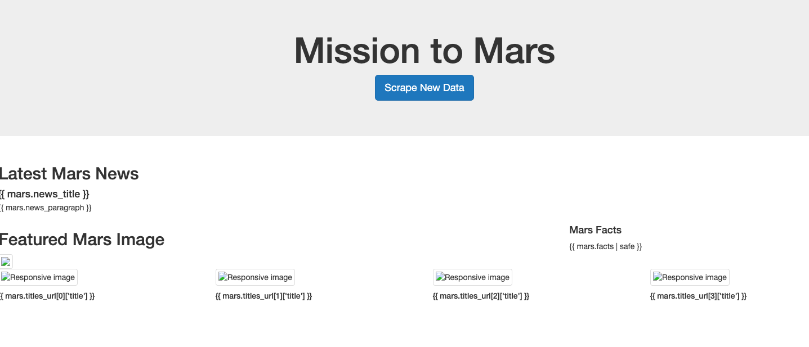
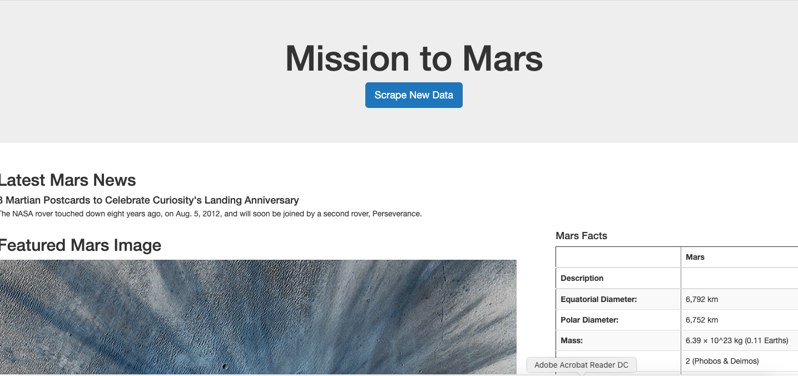

# Chrissy Cho's Mission-to-Mars
### Table of Contents
[ 1. Project Overview ](#desc)  
[ 2. Resources ](#resc)  
[ 3. Objectives ](#obj)  
[ 4. Summary ](#sum)  
[ 5. Challenge Overview ](#chal)  
[ 6. Challenge Summary ](#chalsum)  
[ 7. Challenge Issues ](#find) 

## Project Overview
In this module, we've learned to automate scraping using Splinter and grab the data written in html to extract the information we want to put on our own Web App. 
For this process, we created scraping codes written in python, storing data into MongoDB for Flask to access, and showing the data with some styling using Bootstrap on html file. Throughout the module, we've factored the scraping codes into a few different functions so that we can scrape new data everytime the website updates their information. For the final display, we used the html with Bootstrap components to add some styling to the Web App with the newest article on Mars, summary of the article, featured image of Mars, and table of Mars' information. During running the server to access the Web Page, we had some issues displaying scraped data on the Web App. The issues will be discussed in the later section. 

## Resources
- Data Source: [app_challenge.py](https://github.com/chrissycho/Mission-to-Mars/blob/master/challenge/app_challenge.py), [scraping_challenge.py](https://github.com/chrissycho/Mission-to-Mars/blob/master/challenge/app_challenge.py), [index_challenge.html](https://github.com/chrissycho/Mission-to-Mars/blob/master/challenge/templates/index_challenge.html)
- Software: BS4, Chromedriver, Flask, Flask_PyMongo, MongoDB, Python, Splinter
- Dependencies: BeautifulSoup, Browser, Datetime, Pandas 

## Objectives
- Gain familiarity with and use HTML elements, as well as class and id attributes, to identify content for web scraping.
- Use BeautifulSoup and Splinter to automate a web browser and perform a web scrape.
- Create a MongoDB database to store data from the web scrape.
- Create a web application with Flask to display the data from the web scrape.
- Create an HTML/CSS portfolio to showcase projects.
- Use Bootstrap components to polish and customize the portfolio

## Summary
First, we started off by downloading Web Scraping Tools such as Chromedriver, Splinter, BeautifulSoup, Flask, and MongoDB. Using VSCode, we wrote scripts to automate a web brwoser and perform a web scrape. Then, we created a web application with Flask using routes to scraping codes and MongoDB. Through the routes, we had the automate browser to store data into a MongoDB database everytime we scrape new data. 

## Challenge Overview
In this challenge, we will be scraping high-resolution images of Mars from different hemispheres. Then, we will save the scraped data into a MongoDB database as well as updating the web application and Flaks to display the data from the web scrape. Styles to the web app will be added using the Bootstrap components. 

### Challenge Overview
- Use BeautifulSoup and Splinter to automate a web browser and scrape high-resolution images.
- Use a MongoDB database to store data from the web scrape.
- Update the web application and Flask to display the data from the web scrape.
- Use Bootstrap to style the web app.

## Challenge Summary
For the purpose of the challenge, we obtained high-resolution images for each of Mars' hemispheres using a for loop function. We stored the URL and title as one dictionary for each hemisphere combined into a list. 

-This is the template of what our web app will look like.

-This is the result of our scraped data being displayed on our web app. Unfortunately, the server was down for the challenge part so I couldn't test out the codes but I've iterated the four links to get each hemisphere's high-resolution image and displayed them with their title on the web app. Since the scraped data are saved as key:value pairs in a dictionary for each hemisphere ('image':url, 'title':titme of hemisphere) and all of the dictionaries were stored into a list. On the html file, I've called each image and displayed them by their index from the list.

## Challenge Issues
Throughout this module, I faced challenges in displaying all the information on the web app with the same codes that everyone used. The web app I made wasn't properly displaying the title, paragraph, and table. I've thoroughly checked each scraping code and inspected any error although I didn't have any error message in scripts or mongo. Finally, I inspected the scraping codes by using breakpoints to find out which code was being skipped. As suggested by the lecturer, I was able to print the try-except error message for why the breakpoint was not scraping the data properly. It turns out that I had to simply install the certifications for the Python, which was not a problem before in other assignments with Python. Finally, I was able to display the layout of my web app as I wanted except making adjustments to the sizes of images and table. 